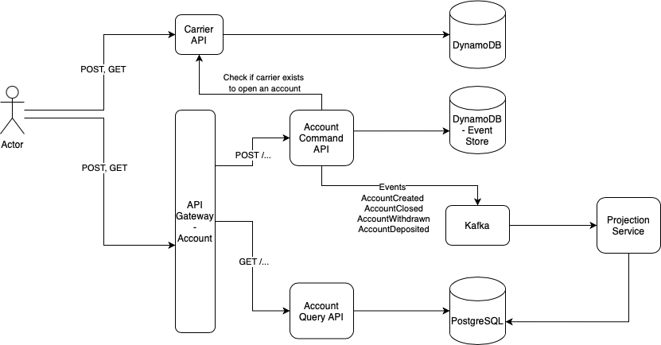

# Projeto de Conta Digital Dock

## Descrição do Problema

A Dock busca revolucionar o mercado financeiro com uma nova conta digital que permita a seus clientes realizar transações de forma segura e eficiente. O desafio consiste em gerenciar portadores de contas digitais e suas transações, garantindo a integridade e a consistência dos dados, ao mesmo tempo em que oferece uma experiência de usuário fluida.

## Solução Proposta

A solução foi construída utilizando os padrões de **CQRS (Command Query Responsibility Segregation)** e **Event Sourcing**. Esses conceitos permitem separar as operações de escrita (comandos) das operações de leitura (consultas), resultando em um sistema mais escalável e responsivo.

### Vantagens de CQRS e Event Sourcing:

1. **Escalabilidade**: O uso de CQRS permite que o sistema escale independentemente para operações de leitura e escrita, o que é crucial em ambientes com alta demanda.
2. **Auditabilidade**: O Event Sourcing armazena todas as mudanças de estado como eventos, permitindo auditoria e rastreabilidade completas.
3. **Desempenho**: A separação de consultas e comandos permite otimizações específicas para cada tipo de operação, melhorando a performance geral.
4. **Flexibilidade**: Novas funcionalidades podem ser adicionadas ao sistema sem a necessidade de grandes reestruturações.

## Diagrama de Arquitetura



## Arquitetura do Sistema

A arquitetura do sistema é composta pelos seguintes serviços:

### 1. Carrier Service

- **Descrição**: Gerencia os portadores (donos das contas digitais).
- **Endpoints**:
  - `POST /carrier/v1/carrier`: Criação de portador.
  - `DELETE /carrier/v1/carrier/:CPF`: Remoção de portador.
  - `GET /carrier/v1/carrier/:CPF`: Busca de portador.

### 2. Account Command Service

- **Descrição**: Responsável por processar comandos relacionados às contas, como criação, depósito, saque e fechamento.
- **Endpoints**:
  - `POST /account/v1/command/account`: Criação de conta.
  - `POST /account/v1/command/account/:CPF/deposit`: Depósito em conta.
  - `POST /account/v1/command/account/:CPF/withdrawn`: Saque de conta.
  - `POST /account/v1/command/account/:CPF/close`: Fechar conta.

### 3. Account Query Service

- **Descrição**: Fornece dados de consulta sobre contas e extratos.
- **Endpoints**:
  - `GET /account/v1/query/account/:CPF/details`: Detalhes da conta.
  - `GET /account/v1/query/account/:CPF/statements`: Extrato da conta.

### 4. Projection Service

- **Descrição**: Consome eventos do Kafka e cria projeções das contas e extratos em uma base de dados relacional.

### 5. API Gateway

- **Descrição**: Encaminha as requisições dos clientes para os serviços apropriados, atuando como um ponto de entrada unificado.
- **Endpoints**:
  - `/account/v1/command`: Roteamento para o Account Command Service.
  - `/account/v1/query`: Roteamento para o Account Query Service.

## Como Executar a Aplicação

1. **Clone o repositório**:

   ```bash
   git clone <URL_DO_REPOSITORIO>
   ```

2. **Navegue até o diretório do projeto**:

   ```bash
   cd <NOME_DO_DIRETORIO>
   ```

3. **Inicie os serviços utilizando Docker Compose**:
   ```bash
   docker-compose up --build
   ```

### Portas e URLs das APIs

- **API Gateway**: [http://localhost:3000](http://localhost:3000)
  - Roteamento para os serviços de comando e consulta de contas.
- **Carrier Service**: [http://localhost:3001](http://localhost:3001)
- **DynamoDB**: [http://localhost:8000](http://localhost:8000) (para fins de teste)
- **PostgreSQL**: [http://localhost:5432](http://localhost:5432) (para fins de teste)
- **Kafka**: [http://localhost:9092](http://localhost:9092) (para fins de teste)

### Documentação das APIs

Informações detalhadas sobre os contratos das APIs podem ser encontradas nos README de cada subprojeto:

- [Carrier Service](./carrier-service/README.md)
- [Account Command Service](./account-command-service/README.md)
- [Account Query Service](./account-query-service/README.md)
- [Projection Service](./projection-service/README.md)

## Conclusão

A implementação deste sistema de conta digital utilizando CQRS e Event Sourcing não apenas atende aos requisitos de gerenciamento de contas e portadores, mas também proporciona uma base sólida para futuras expansões e melhorias. A abordagem modular e os princípios de design utilizados garantem a manutenibilidade e escalabilidade do sistema.
